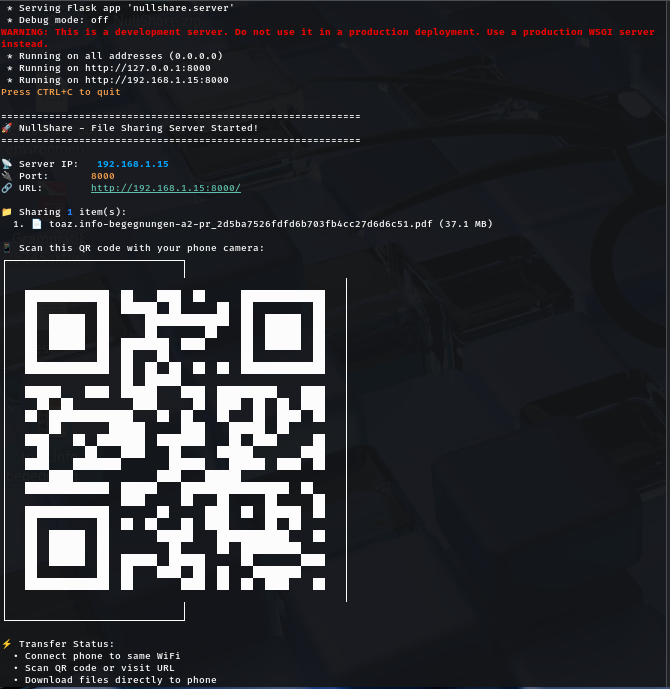
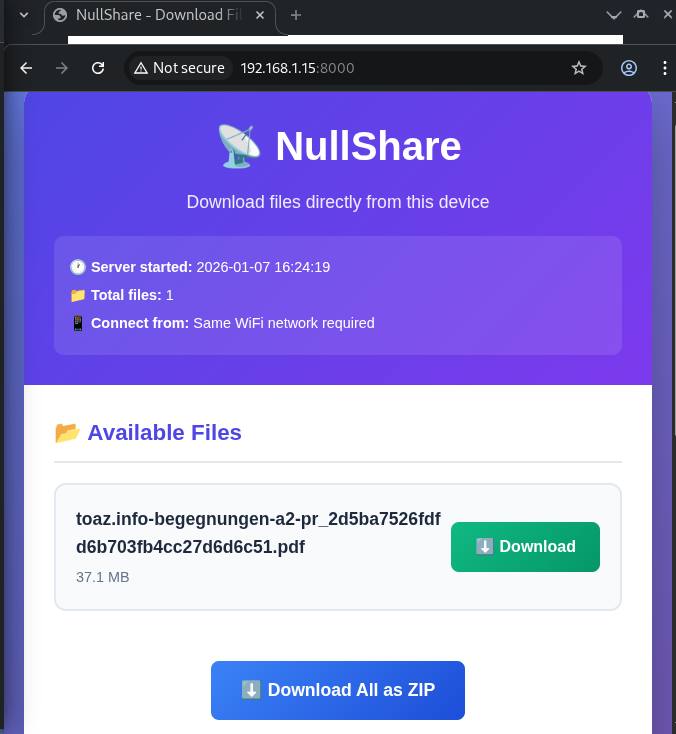

# NullShare 📡➡️📱

**Share files from your computer to phone instantly via QR code. No internet, no cloud, just local WiFi.**

[](https://python.org)
[](https://opensource.org/licenses/MIT)
[](https://github.com/MOOKA-513/NullShare/pulls)

<div align="center">
  
</div>

## ✨ Features

- ⚡ **Blazing Fast** - LAN transfer speeds (much faster than internet)
- 🔒 **100% Private** - Files never leave your local network
- 📱 **No App Needed** - Works in any mobile browser
- 🎯 **One Command** - Simple CLI interface
- 🐧 **Cross-Platform** - Windows, Linux, macOS
- 🔐 **Password Protection** - Optional security for sensitive files
- ⏱️ **Auto-Timeout** - Server stops automatically after transfer
- 📦 **Folder Support** - Auto-zips folders for easy download

## 🚀 Quick Start



### Installation

```bash
# Install from PyPI (coming soon)
pip install nullshare

# Or install from source
git clone https://github.com/MOOKA-513/NullShare.git
cd NullShare
pip install -e .
Basic Usage
bash
# Share a single file
nullshare share document.pdf

# Share a folder (auto-zips)
nullshare share ~/Photos/

# Share with password protection
nullshare share --password secret file.txt

# Share with auto-timeout (5 minutes)
nullshare share --timeout 300 file.txt

📖 How It Works
Start Sharing

bash
nullshare share myfile.pdf
Scan QR Code

Open your phone's camera

Scan the QR code shown in terminal

Make sure phone is on same WiFi

Download

Webpage opens in phone browser

Tap download button

File transfers at WiFi speed

🛠️ CLI Commands
bash
# Share files/folders
nullshare share <file1> <file2> ...

# Options
  --port PORT           Port to use (0 = auto)
  --no-zip              Don't zip folders
  --password TEXT       Set password protection
  --timeout SECONDS     Auto-stop after N seconds
  --one-time            Files can only be downloaded once
  --no-qr               Don't show QR code
  --clean               Clear screen before showing QR
  --verbose             Show detailed information

# Server management
nullshare status        # Check if server is running
nullshare stop         # Stop running server
nullshare discover     # Discover servers on network

# Help
nullshare --help       # Show all commands
nullshare share --help # Show share command help
🎯 Examples
bash
# Share multiple files
nullshare share image1.jpg image2.png document.pdf

# Share current directory
nullshare share .

# Share with custom port
nullshare share --port 9090 file.txt

# Share sensitive files with password
nullshare share --password mypass secret_document.pdf

# Share for one-time download only
nullshare share --one-time invoice.pdf
🏗️ Architecture
text
┌─────────────┐     QR Code     ┌─────────────┐
│   Desktop   │─────────────────│    Phone    │
│   (Server)  │◄──WiFi Transfer─│  (Browser)  │
└─────────────┘                 └─────────────┘
       │                               │
  Python + Flask                 Any Mobile Browser
       │                               │
  Local HTTP Server             Web Interface
       │                               │
  File/Zip Serving              File Download
🔧 Development
bash
# Clone repository
git clone https://github.com/MOOKA-513/NullShare.git
cd NullShare

# Create virtual environment
python -m venv venv
source venv/bin/activate  # On Windows: venv\Scripts\activate
pip install -r requirements.txt

# Install development dependencies
pip install -e ".[dev]"

# Run tests
pytest

# Run linter
black nullshare/
flake8 nullshare/

# Run type checking
mypy nullshare/
📁 Project Structure
text
NullShare/
├── nullshare/          # Main package
│   ├── cli.py         # Command-line interface
│   ├── server.py      # HTTP server
│   ├── qr_generator.py # QR code generation
│   ├── utils.py       # Utilities
│   └── templates/     # Web templates
├── tests/             # Test suite
├── examples/          # Usage examples
├── pyproject.toml     # Project configuration
└── README.md          # This file
🤝 Contributing
Contributions are welcome! Here's how you can help:

Report Bugs - Open an issue with detailed information

Suggest Features - Share your ideas for improvement

Submit Pull Requests - Fix bugs or add features

Improve Documentation - Help make NullShare easier to use

Please read our Contributing Guidelines before submitting.

🐛 Troubleshooting
Problem: Phone can't connect

✅ Ensure both devices are on same WiFi

✅ Check firewall allows connections on the port

✅ Try disabling VPN on either device

Problem: QR code doesn't work

✅ Make sure URL in QR starts with http:// not https://

✅ Some cameras need good lighting for QR scanning

Problem: Slow transfer

✅ This uses local network speed - much faster than internet

✅ Large files (>1GB) may take a few minutes

✅ Ensure good WiFi signal strength

📄 License
This project is licensed under the MIT License - see the LICENSE file for details.

🙏 Acknowledgments
Inspired by local file sharing tools like Snapdrop and LocalSend

Built with amazing Python libraries: Flask, Click, QRCode

Thanks to all contributors and users

📞 Support
📧 Issues: GitHub Issues

💬 Discussion: GitHub Discussions

⭐ Star: If you find this useful, please star the repository!

<div align="center"> Made with ❤️ by <a href="https://github.com/MOOKA-513">MOOKA-513</a> </div>
