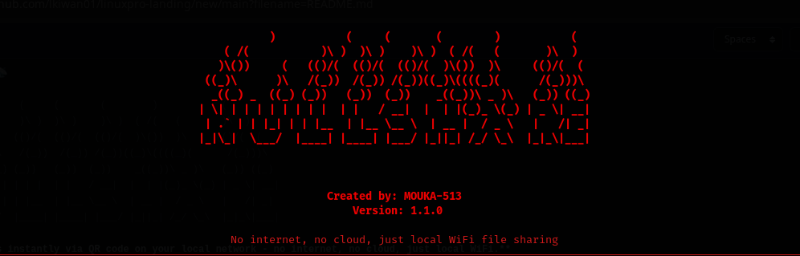
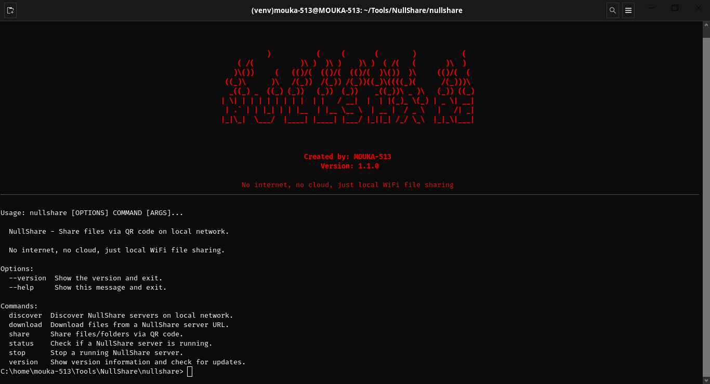
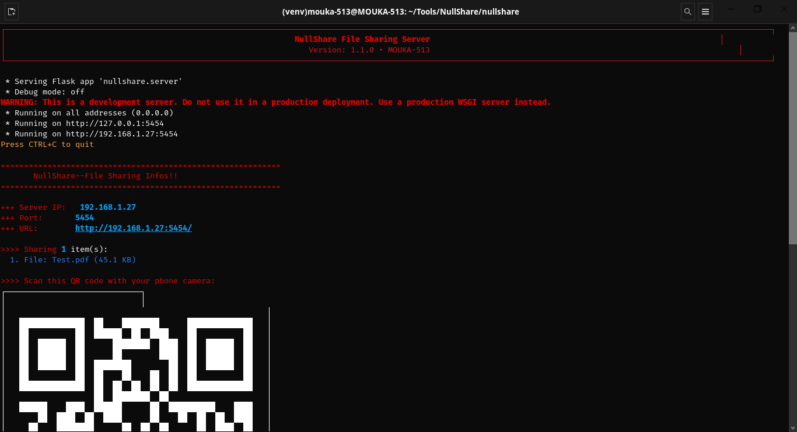
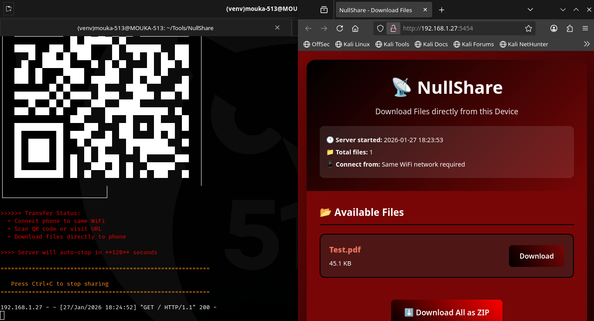

<div align="center" > 
  
   # NullShare 📡 


*Share files instantly via QR code on your local network - no internet, no cloud, just local WiFi.*

***⚠️NOTE : I built this tool because I needed a simple way to send files from my computer to my phone.***
</div>

<p align="center">
  
  
  
  
</p>




## ✨ What Does NullShare Do?

NullShare is a **privacy-focused, lightning-fast** tool that lets you transfer files from your computer to your phone **instantly** using a QR code. It creates a local web server on your computer and generates a QR code that your phone scans to download files directly over WiFi.

### 🚀 **Key Features**
- ⚡ **Blazing Fast** - LAN transfer speeds (no internet required)
- 🔒 **100% Private** - Files never leave your local network
- 📱 **No App Needed** - Works in any mobile browser
- 🎯 **One-Command Simplicity** - Simple CLI interface
- 🐧 **Cross-Platform** - Windows, Linux, macOS
- 🔐 **Password Protection** - Optional security for sensitive files
- ⏱️ **Auto-Timeout** - Server stops automatically after transfer
- 📦 **Folder Support** - Automatically zips folders for transfer

## 📸 Screenshots

### 1. Starting a File Share 

*Start sharing with a single command ``` nullshare share TEST.pdf ``` - generates QR code instantly*

### 2. QR Code for Phone Connection

*Scan this QR code with your phone's camera to connect*

### 3. Mobile Download Interface

*Clean web interface on your phone for downloading files*

## 🛠️ Installation


### Prerequisites
- Python 3.7 or higher
- Git (optional, for installation from source)

### Manual Install
```bash
# Clone the repository
git clone https://github.com/MOUKA-513/NullShare.git
cd NullShare

# Create virtual environment (recommended)
python -m venv venv
source venv/bin/activate  # Linux/Mac
# or
venv\Scripts\activate    # Windows

# Install dependencies
pip install -r requirements.txt
pip install -e .
```
## Quick Start Guide
### Share a Single File
```bash
nullshare share document.pdf
```
**this will:**
- **1.** Start a local server
- **2.** Generate a QR code in your terminal
- **3.** Wait for your phone to connect
### Share Multiple Files
```bash
nullshare share image1.jpg image2.png document.pdf
```
### Share an Entire Folder
```bash
nullshare share ~/Downloads/my_project/
# Folders are automatically zipped for easy transfer
```
## Advanced Usage
### Password Protection
```bash
nullshare share --password mypass secret_document.pdf
# It generate a link with a password token
```
### Custom Port & Auto-Timeout
- You can choose any of the --port & --timeout you want to use.
```bash
nullshare share --port 9090 --timeout 300 large_file.pdf
```
- --port: Use a specific port (default: auto-assigned) 
- --timeout: Auto-stop server after 300 seconds (5 minutes)
### One-Time Download
```bash
nullshare share --one-time sensitive_file.txt
```
- Server stops after the first successful download.
### All Available Options
```bash
nullshare --help
nullshare share --help

# Available options:
# --port PORT        Port to use (0 = auto)
# --no-zip          Don't zip folders
# --password TEXT   Password protection
# --timeout SECONDS Auto-stop server after seconds
# --one-time        Allow only one download
# --no-qr           Hide QR code display
# --clean           Clear screen before showing QR
# --verbose         Show detailed output
#EXAMPLE :
nullshare share ~/Desktop/Test.pdf --port 2222 --one-time --timeout 30 --clean
```
## How It Works - Simple 5-Step Process
```text
┌─────────────┐    Start     ┌─────────────┐    Generate    ┌─────────────┐
│   Your PC   │─────────────▶│  NullShare  │─────────────▶│    QR Code   │
│  (Server)   │              │   Server    │               │   & URL      │
└─────────────┘              └─────────────┘               └─────────────┘
        │                           │                              │
        │ Same WiFi Network         │                              │
        └───────────────────────────┼──────────────────────────────┘
                                    │
                         ┌──────────▼──────────┐
                         │     Phone Scans     │
                         │      QR Code        │
                         └──────────┬──────────┘
                                    │
                         ┌──────────▼──────────┐
                         │   Download Files    │
                         │   Directly to Phone │
                         └─────────────────────┘
```

### Step-by-Step:
- **1.** Start Sharing on your computer.
  ```bash
  nullshare share your-file.txt
  ```
- **2.** Get QR Code: NullShare generates a QR code with local IP URL.
- **3.** Scan on Phone: Open camera app and scan QR code.
- **4.** Download: Files download directly to phone.
- **5.** Auto-Cleanup: Server stops automatically or when you press Ctrl+C

## Technical Architecture
  ```text
┌─────────────┐     QR Code     ┌─────────────┐
│   Desktop   │────────────────▶│    Phone    │
│   (Server)  │◀──WiFi Transfer │  (Browser)  │
└─────────────┘                 └─────────────┘
       │                               │
  Python + Flask                 Mobile Browser
       │                               │
  Local HTTP Server             Web Interface
```

## 🔄 Comparison with Alternatives
| Feature         | NullShare              | Email/Cloud        | USB Cable           | Other Tools        |
|-----------------|------------------------|--------------------|---------------------|--------------------|
| Speed           | LAN Speed (Fastest)    | Internet Speed     | USB 2.0 / 3.0       | Varies             |
| Privacy         | Local Only             | Third-Party Servers| Direct              | Varies             |
| Convenience     | QR Code Scan           | Multiple Steps     | Physical Connection | App Required       |
| Setup Time      | Seconds                | Minutes            | Minutes             | Varies             |
| Cross-Platform  | Yes                    | Yes                | OS Dependent        | Often Limited      |

## 📄 License
MIT License - see LICENSE file for details.

## 🙏 Acknowledgments
-  Flask team for the amazing web framework

- QRcode library developers

- All contributors and testers

- You for using NullShare! ❤️

### 🤝 Let's Connect!

<div align="center">

[](https://www.linkedin.com/in/mouka-513ooo/)
[](https://twitter.com/m0ukaa513)
[](mailto:mouka-513ooo@protonmail.com)

</div>

<p align="center"> Made with ❤️ by <a href="https://github.com/MOUKA-513">MOUKA-513</a> </p><p align="center"> ⭐ Star this repo if you find it useful! </p>

